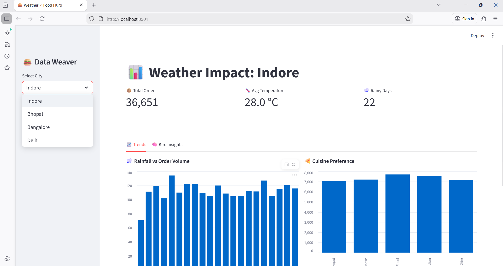
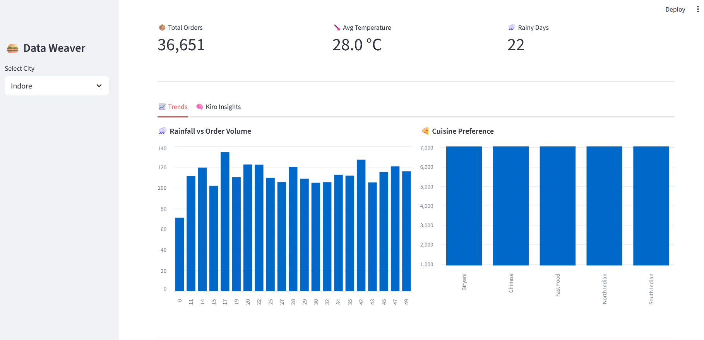
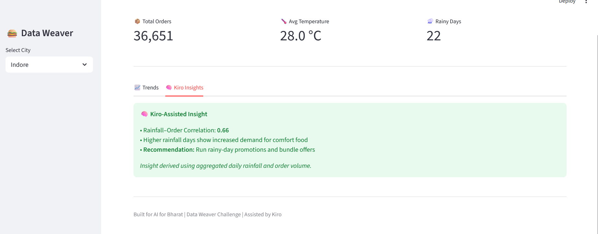

**kiro-Weather-Food-Data-Weaver-Dashboard**

**A Data Engineering pipeline that weaves meteorological data with food ordering trends to predict consumer behavior.**

 *Built for AI for Bharat | Week 3: The Data Weaver*

📖 Overview
Does rain make us crave comfort food? This project answers that question by weaving together two disparate datasets: **Weather Logs** and **Food Order Histories**.

Using a **Self-Contained ETL Pipeline**, this system:
1.  **Simulates** realistic API data (to ensure robust demos).
2.  **Weaves (Merges)** datasets using semantic keys (`Date` + `City`).
3.  **Visualizes** correlations via an interactive Streamlit dashboard.
4.  **Generates Insights** using a rule-based logic engine.

 Dashboard Demo
*(Screenshots of the system in action)*

### 1. The Dashboard


### 2. Trends & Correlations


### 3. AI-Driven Insights


 Project Structure
A professional data engineering structure separating "Raw Ingestion", "ETL Processing", and "Frontend Visualization".

```text
weather-food-weaver/
│
├── .kiro/                 
│   └── prompts.md
│
├── app/
│   └── app.py             
├── data/                   
│   ├── food_orders_raw.csv
│   ├── weather_raw.csv
│   └── merged_data.csv    
│
├── src/
│   ├── data_generator.py   
│   └── etl_pipeline.py     
│
├── screenshots/            
├── requirements.txt
└── README.md
